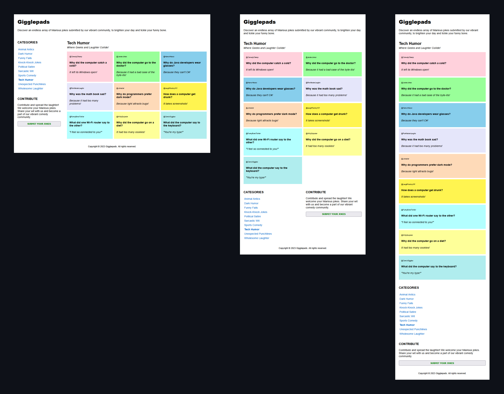

## CSS | Activity #2 (Guided): Internal and External Styles, Responsive Design
In this activity, we will re-create **Gigglepads** from **CSS | Activity #1 (Guided)**
using **Internal** and **External** stylesheets, and incorporate responsive design:



---

### Development Setup

The original HTML template is already provided for you at
[**src/index.html**](src/index.html).
Use it while following with this guide.

To test your output, simply open it in your preferred web browser.

---

### Internal Styles
Internal styles are placed within the HTML file
using the `<style>` tag  inside the `<head>` section.

Let's use the `<style>` tag in [**index.html**](src/index.html)
and write the style for the body element and grid layout container.
We will add more styles later.
```html
<!DOCTYPE html>
<html lang="en">
<head>
    <meta charset="UTF-8">
    <meta name="viewport" content="width=device-width, initial-scale=1.0, maximum-scale=1.0, user-scalable=no">
    <title>Gigglepads</title>

    <style>
        body {
            font-family: Arial, sans-serif;
        }
        
        body > div {
            display: grid;
            grid-template-columns: 1fr 3fr;
            grid-column-gap: 8px;
            grid-row-gap: 8px;
        }
        
        /* add more styles starting here */
        
    </style>
</head>

...
```

---

### Basic CSS Selectors
CSS selectors are patterns used to target and select
specific or a group of HTML elements on a web page.
They allow us to apply styles to those elements
either individually or as a group.

To apply the same style to multiple selectors, separate them with commas.
Selectors are followed by curly brackets `{ }` where individual styles are defined.

We will use some basic CSS Selectors that are suitable for our project.

***Add the following styles in your `<style>` tag
and observe your output for every change.***

---

#### 1. Element Selector
An **element selector** is named after the HTML tag without angle brackets.
For instance, `p` selects all `<p>` elements.


- Select the primary layout elements,
  and apply a common `padding` of `15px`:
    ```css
    header, nav, aside, main, footer, article {
        padding: 15px;
    }
    ```
- Select each primary layout element,
  and position them  in the grid:
  ```css
  header {
      grid-column-start: 1;
      grid-column-end: 3;
  }
  
  nav {
      grid-row-start: 2;
      grid-row-end: 3;
  }
  
  aside {
      grid-row-start: 3;
  }
  
  main {
      grid-row-start: 2;
      grid-row-end: 5;
  }
  
  footer {
      grid-row-start: 5;
      grid-column-start: 1;
      grid-column-end: 3;
      text-align: center;
  }
  ```
We are going to use more element selectors as we demonstrate
the other basic CSS selectors.

---

#### 2. Child Selector
The **child selector** in CSS is used to target elements
that are ***direct children*** of a specified parent element.
It is denoted by the greater-than sign `>`.

- Select `<header>` element, then within it,
  select the `<h1>` child with the text **"Gigglepads"**,
  and set its `font-family` and `margin-top` properties.
  ```css
  header > h1 {
      font-family: 'Arial Black', sans-serif;
      margin-top: 0;
  }
  ```

- Select `<nav>` element, then within it,
  select the `<h3>` child with the text **"CATEGORIES"**,
  and set its `margin-top` property.
  ```css
  nav > h3 {
      margin-top: 0;
  }
  ```

- Select `<nav>` element, then within it,
  select the `<ul>` child,
  and set its `padding`, `margin`, and `list-style-type` properties.
  ```css
  nav > ul {
      padding: 0;
      margin: 0;
      list-style-type: none;
  }
  ```

- Select `<nav>` element, then within it,
  select the `<ul>` child.
  Inside the `<ul>` element, select each `<li>` child
  and set its `padding` property.
  ```css
  nav > ul > li {
      padding: 4px;
  }
  ```

- Select `<nav>` element, then within it,
  select the `<ul>` child.
  Inside the `<ul>` element, select each `<li>` child.
  Finally, within each `<li>`,
  select its `<a>` child and set its `text-decoration` property.
  ```css
  nav > ul > li > a {
      text-decoration: none;
  }
  ```

- Select `<aside>` element, then within it,
  select the `<h3>` child with the text **"CONTRIBUTE"**,
  and set its `margin-top` property.
  ```css
  aside > h3 {
      margin-top: 0;
  }
  ```

---

#### 3. Descendant Selector
The **descendant selector** in CSS is used to target elements
that are nested inside a specified parent element,
regardless of how deeply they are nested.
It is denoted by a *space* between the parent element
and the descendant element.

Unlike the child selector, the descendant selector selects
not only direct children but all descendants
of the specified parent element.

- Select `<aside>` element, then within it,
  select any `<button>` element,
  and set its `font-weight`, `color`, `padding`, and `width` properties.
  ```css
  aside button {
      font-weight: bold;
      color: green;
      padding: 6px;
      width: 100%;
  }
  ```

- Select `<main>` element, then within it,
  select any `<section>` element,
  and set its grid properties.
  ```css
  main section {
      display: grid;
      grid-template-columns: 1fr 1fr 1fr;
      grid-column-gap: 8px;
      grid-row-gap: 8px;
      grid-auto-rows: minmax(130px, auto);
  }
  ```
---

#### 4. Class Selector
The **class selector** in CSS is used to target elements
based on their specific **class attribute**.
It allows us to apply styles to multiple elements
that share the same class.

The class selector is denoted by a period `.`
followed by the class name that we want to target.
For example, the selector `.username` would target any element
with `class="username"`.

To target a specific HTML element with a specific class,
use `tagname.classname`.
For example, the selector `p.username` will target
`<p class="username">`.

An HTML element can have more than one class,
example: `<p class="message error">`.
To specifically select this element,
we can use the selector `.message.error`.

<p>
  <small>
    To demonstrate this using our <a href="src/index.html">index.html</a>,
    The <b>"Tech Humor"</b> <code>&lt;li&gt;</code>
    in <code>&lt;nav&gt;</code> now has <code>class="active"</code>.
    Also, every joke <code>&lt;article&gt;</code> now has <code>class="joke"</code>,
    and the two paragraphs inside each joke have <code>class="username"</code> and <code>class="punchline"</code>.
  </small>
</p>

- Select `<nav>` element, then within it,
  select the `<ul>` child.
  Inside the `<ul>` element,
  select the `<li>` child with `class="active"`.
  Finally, within that `<li>` tag,
  select its `<a>` child and set its `font-weight` property.
  ```css
  nav > ul > li.active > a {
      font-weight: bold;
  }
  ```

- Select any element with `class="joke"`.
  Inside that element,
  select any descendant with `class="username"`,
  and set its `font-style` and `font-size` properties.
  ```css
  .joke .username {
      font-style: italic;
      font-size: 10px;
  }
  ```

- Select any element with `class="joke"`.
  Inside that element,
  select any descendant with `class="punchline"`,
  and set its `font-style` property.
  ```css
  .joke .punchline {
      font-style: italic;
  }
  ```
In the last two examples, we can achieve the same styles
just by targeting the classes `.username` and `.punchline` individually.
However, we specifically wanted these classes to be descendants of `.joke`.

---

#### 5. Id Selector
The **id selector** in CSS is used to target elements
based on their specific id attribute.
It allows us to apply styles to a single unique element on the web page.

The id selector is denoted by a hash `#`
followed by the id that we want to target.
For example, the selector `#header` would target the element
with `id="header"`.

To target a specific HTML element with a specific id, use `tag#id`.
For example, the selector `h1#title` will target `<h1 id="title">`.

Similarly, to target a class of elements but with a specific id, use `.class#id`.
For example, the selector `.username#user1` will target elements
with the `class="username"` and `id="user1"`.

<p>
  <small>
    To demonstrate this using our <a href="src/index.html">index.html</a>,
    The <b>"Tech Humor"</b> <code>&lt;h2&gt;</code> in <code>&lt;main&gt;</code>
    now has <code>id="category"</code>,
    while the <b><i>"Where Geeks and Laughter Collide!"</i></b> <code>&lt;p&gt;</code>
    now has <code>id="tagline"</code>.
    Also, every joke <code>&lt;article&gt;</code> now has ids from
    <code>id="joke1"</code> to <code>id="joke9"</code>.
  </small>
</p>

- Select `<main>` element, then within it,
  find a descendant element with `id="category"`,
  and set its `margin-top` and `margin-bottom` properties.
  ```css
  main #category {
      margin-top: 0;
      margin-bottom: 0;
  }
  ```

- Select `<main>` element, then within it,
  find a descendant element with `id="tagline"`,
  and set its `font-style` and `margin-top` properties.
  ```css
  main #tagline {
      font-style: italic;
      margin-top: 4px;
  }
  ```

***TODO:***
Add the internal styles to set the `background-color` of each joke,
using the color references provided in **CSS | Activity #1 (Guided)**.

---

### Responsive Design

We can implement **responsive design** to ensure
that our content looks good on smaller screens by using **CSS media queries**,
that allow us to create separate rules for different screen sizes
and adjust the grid layout accordingly.

***Add the following media queries to the end of your current CSS styles:***

- for medium sized screens (up to 768px)
  ```css
  /* RESPONSIVE STYLES FOR SCREEN SIZES UP TO 768px */
  @media screen and (max-width: 768px)
  {
      /* grid container and jokes section: contain two equal columns */
      body > div, main section {
          grid-template-columns: 1fr 1fr;
      }
  
      /* <main> element: span 2 columns, remove top padding */
      main {
          grid-column-start: 1;
          grid-column-end: 3;
          padding-top: 0;
      }
  
      /* <nav> element: occupy column 1 of row 5 */
      nav {
          grid-column-start: 1;
          grid-column-end: 2;
          grid-row-start: 5;
          grid-row-end: 6;
      }
  
      /* <aside> element: occupy column 2 of row 5 */
      aside {
          grid-column-start: 2;
          grid-column-end: 3;
          grid-row-start: 5;
          grid-row-end: 6;
      }
  
      /* <footer> element: place at row 6 */
      footer {
          grid-row-start: 6;
      }
  }
  ```

- for small screens (up to 576px)
  ```css
  /* RESPONSIVE STYLES FOR SCREEN SIZES UP TO 576px */
  @media screen and (max-width: 576px)
  {
      /* grid container and jokes section:         */
      /*     contain one column, remove column gap */
      body > div, main section {
          grid-template-columns: 1fr;
          grid-column-gap: 0;
      }
  
      /* <main>, <nav>, <aside> elements: span 1 columns */
      main, nav, aside {
          grid-column-start: 1;
          grid-column-end: 2;
      }
  
      /* <aside> element: place at row 6 */
      aside {
          grid-row-start: 6;
      }
  
      /* <footer> element: place at row 7 */
      footer {
          grid-row-start: 7;
      }
  }
  ```
Once you've added these media queries, test your output by resizing your browser
to ensure your content adjusts correctly on large, medium, and small screens.

---

### External Styles
External styles in CSS refer to separate style sheets stored in external `.css` files,
allowing us to apply consistent and shared styling across multiple web pages
by linking them to the HTML documents using the `<link/>` tag.

*Example:*
```html
<link rel="stylesheet" href="css/styles.css" />
```

<p>
  <small>
    <b>NOTE:</b>
    CSS files exclusively contain CSS rules
    and do not include any HTML tags,
    not even the <code>&lt;style&gt;</code> tag.
  </small>
</p>


***TODO:***
1. Create a new file named **styles.css** inside the [**src/css**](src/css) folder.

2. Cut all the code from within your `<style>` tag
   and paste it into the newly created **styles.css** file.

3. In your [index.html](src/index.html) file,
   replace the `<style>` tag with the following `<link>` tag:
    ```html
    <link rel="stylesheet" href="css/styles.css" />
    ```
   Then, check the output of your webpage to ensure that
   the styles are still working as expected.

4. Add that `<link/>` tag to the other HTML pages
   in the [src](src) folder and verify 
   if the external stylesheet you made works on all pages.
